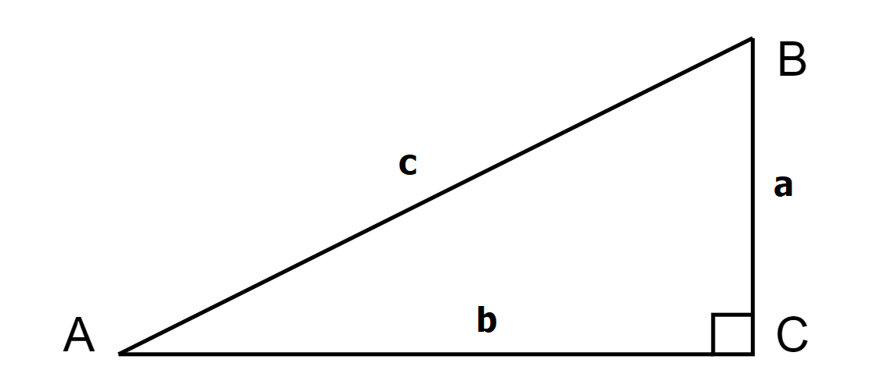
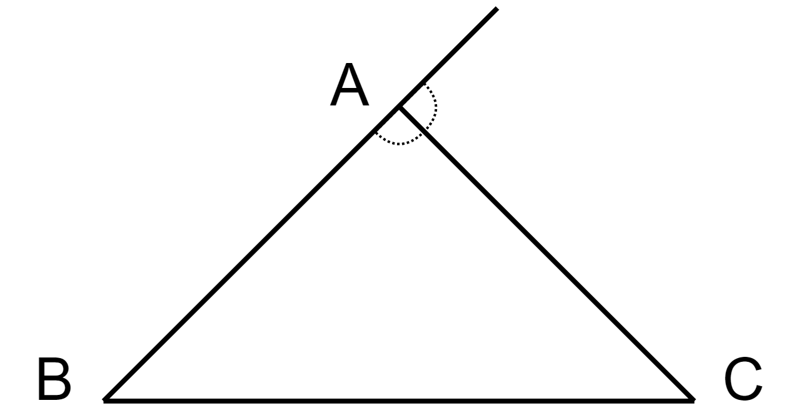
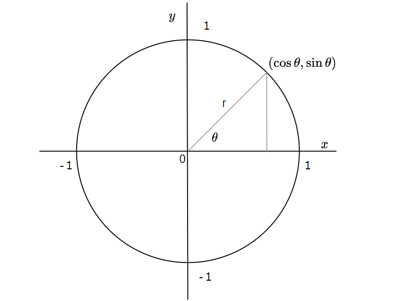

# 三角形、三角関数

| #    | プレビュー                         |   使用例   |
| ---- | ------------------------ | ---- |
| 000  |  | 直角三角形  |
| 001  |   | 余弦定理の説明  |
| 002  |   | ヘロンの公式の説明  |
| 003  |   | 内角と外角の関係  |
| 004  |   | 単位円  |
